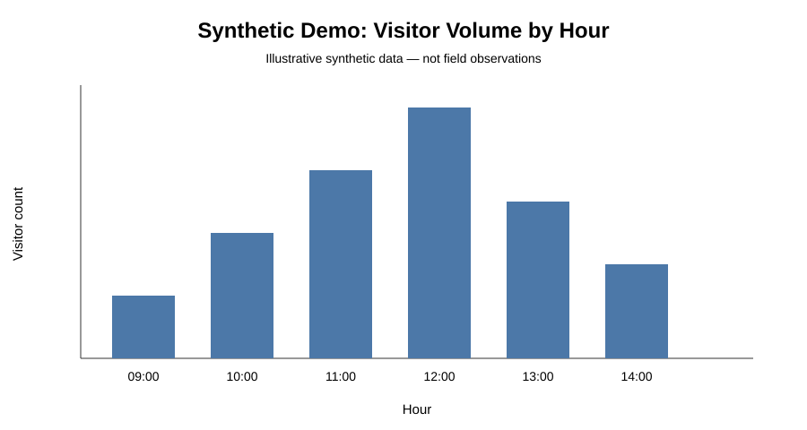
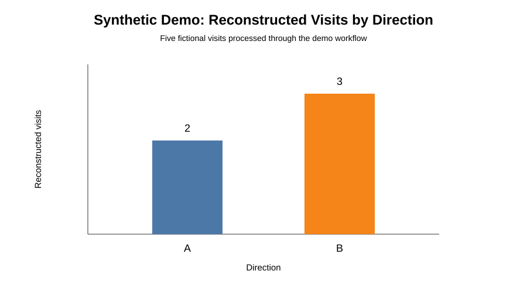
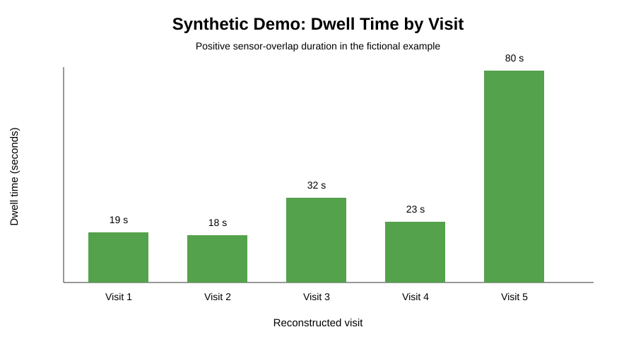

# Visitor Monitoring Toolkit

Python tools developed as part of an M.Sc. research project in Mapping and Geoinformation Sciences at the Technion – Israel Institute of Technology.

The toolkit supports processing and analysis of visitor-monitoring data collected in outdoor environments. It combines BLE-derived visits with manual observations and other counting sensors, and provides tools for calibration, temporal analysis, dwell-time analysis, directional summaries, and occupancy estimation.

## Example outputs

The visualizations below use **synthetic demonstration data only**. They illustrate the types of outputs produced by the analysis tools and do not represent research participants or field observations.

### Hourly visitor volume

### Directional patterns

### Dwell time

## What is included

### BLE processing (`src/ble_processing.py`)
Processes raw detections from two BLE sensors (A/B), segments repeated detections into events, associates related events with `Device_ID` values, and derives visit-level outputs. The processing includes configurable temporal windows and metadata-based rules designed to reduce duplicate identities associated with changing BLE addresses.

### Sensor comparison (`src/sensor_comparison.py`)
Standardizes and compares visitor counts from BLE, manual observations, IR counters, pressure counters, and camera-derived counts. The script supports directional A/B summaries, hourly aggregation, plots, and exported comparison results.

### Calibration analysis (`src/calibration_analysis.py`)
Aggregates repeated comparison sessions and estimates calibration factors relative to manual counts. It also calculates error statistics including MAE and MAPE before and after calibration.

### Hourly visitor analysis (`src/hourly_analysis.py`)
Combines one or more visit CSV files and produces hourly visitor-volume summaries for individual days, all days combined, and an average day. It also summarizes A/B direction ratios.

### Dwell-time analysis (`src/dwell_analysis.py`)
Analyzes dwell time by hour across one or more visit files, with optional minimum/maximum dwell filters and mean/median summaries.

### Occupancy analysis (`src/occupancy_analysis.py`)
Estimates the number of simultaneous visitors through time from visit intervals derived from detections at sensors A and B.

## Typical workflow

1. Process raw BLE detections from sensors A and B.
2. Generate event-, device-, and visit-level data.
3. Compare BLE-derived visitor counts with reference sensors or manual observations.
4. Estimate calibration factors and error metrics.
5. Explore hourly volume, direction, dwell time, and occupancy patterns.

## Input data

The scripts operate on CSV-based monitoring data. Expected columns depend on the tool. For example, the BLE pipeline expects raw fields such as:

- `MAC`
- `RSSI`
- `timestamp`
- optional device metadata (`name`, `manufacturer`, `serviceUUID`)

Analysis tools use processed visit fields such as `global_start`, `direction`, and `dwell_sec`.

No research datasets are included in this repository. The `examples/` directory contains a small **fully synthetic** dataset created only to demonstrate the expected input structure and pipeline outputs.

## Synthetic demo

A small fictional BLE dataset is included under `examples/synthetic_data/`. It contains no field observations or participant data. Running the BLE processing workflow on this demo produces five reconstructed visits with A/B direction labels and positive dwell-time overlaps; reference outputs are provided under `examples/expected_output/`.

## Technologies

- Python
- pandas
- NumPy
- Matplotlib
- Tkinter

## Research context

These tools were developed to support research on automated monitoring of visitor activity in protected areas. The broader research evaluates how sensor-derived data can be used to characterize visitor volume, temporal patterns, direction of movement, dwell time, and occupancy.

The repository is intended as a reproducible code portfolio and does not contain raw field data or personally identifying information.

## Author

**Yuval Fisher**  
M.Sc. candidate, Mapping and Geoinformation Sciences  
Technion – Israel Institute of Technology
